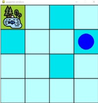

## RL-Final_Project
### Farmer's helper! :man_farmer: :helicopter: 

#### *The goal* of our project is a drone with a watering system uses Q-learning  to irrigate the farmland until the soil moisture reaches sufficient moisture. In order to solve the problem of food crisis in the future and can reduce the manpower.<br>

#### Clone the package **Final_Project** in our github,  `cd gym-examples` and  `pip install - e .` <br/>Our project use Open AI gym toolkit to built environment and  pygame to display. Please `pip install gym` and `pip install pygam`<br>
***

#### *Environment : Farm which has the moisture sensor.*
#### *Agent : The Drone (blue circle) with watering system.*
#### *Actions : right, up ,left ,down ,watering.*
#### *State : The state of agent * The state of ground moisture * The state of tank capacity.*
#### The environment I built is a four by four farmland with a pond in it. The degree of dark color represents the soil humidity.<br/>*(The location of the drone and the humidity of the soil will be reset randomly in each episode.)*


 
 ***
 ### Reward
 
 ```
 def step(self, action):
        # Step Function
        reward = 0

        # Map the action (element of {0,1,2,3,4}) to the direction we walk in
        direction = self._action_to_direction[action]
        
        
        
        before_agent_location = self._agent_location.copy()
        # We use `np.clip` to make sure we don't leave the grid 
        self._agent_location = np.clip(
            self._agent_location + direction, 0, self.size - 1
        )
        
        if np.array_equal(before_agent_location, self._agent_location) and action != 4:
            reward = -100

        # An episode is done iff the agent has reached the target
        terminated = np.array_equal(self._wet_Number, self.perfact)

        if terminated:
            reward = 1000
            
        #describe the agent location 
        agent_location = self.space[self._agent_location[0],self._agent_location[1]]
        
        # choses watering and agent not at the pound
        if agent_location > 0 and action == 4:
            agent_location = agent_location - 1         
            #if water in tank
            if self.water > 0:  
                
                # if the ground not moisture enough
                if self._wet_Number[agent_location] <= 0:
                    
                    # can watering    
                    self._wet_Number[agent_location] += 1
                    self.water = self.water - 1
                    reward = 50
                # if moisture enough
                else:
                    # can not watering
                    reward = -100
            else:
                # if no water in tank
                reward = -100

        #refill tank
        if np.array_equal(self._agent_location, self._water_location):   
  
            if self.water <= 2:
                reward = 10
            else:
                reward = -20
            self.water = 9

        reward = reward + (-1 + np.sum(self._wet_Number) / 15) #encourages the agent to watering

        observation = self._get_obs()
        info = self._get_info()

        if self.render_mode == "human":
            self._render_frame()

        return observation, reward, terminated, False, info 
 ```


***
### Problem 
- **Memory Error** — The lager state let to a memory error that can not be fixed. If the state of the farm size more than four by four or the state of ground moisture more than two. The total state will be too large to estimate.I think changing the algorithm to DQN can improve this problem.
- **Observation Space Not Enough** — The agent will miss the goal if its observation space does not contain the tank.  I think it might be caused by the agent not knowing when to refill the tank. I solved this problem after considering the state of the tank for the agent.
